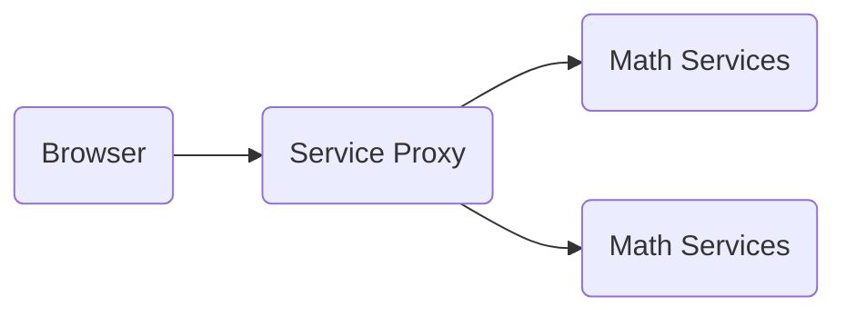

# AREP_PARCIAL2

## Reto
La secuencia de Lucas es una secuencia de enteros que lleva el nombre del matemático François Édouard Anatole Lucas (1842-1891), quien estudió tanto esa secuencia como su relación con la secuencia de Fibonacci.

Diseñe, construya y despliegue un aplicación web para investigar la secuencia de Lucas. El programa debe estar desplegado en tres máquinas virtuales de EC2 de AWS como se describe abajo. Las tecnologías usadas en la solución deben ser maven, git, github, maven, sparkjava, html5, y js. No use liberías adicionales.

## Problema
Diseñe un prototipo de sistema de microservicios que tenga un servicio (En la figura se representa con el nombre Math Services) para computar la secuencia de enteros. El servicio de la secuencia debe estar desplegado en al menos dos instancias virtuales de EC2. Adicionalmente, debe implementar un service proxy que reciba las solicitudes de llamdo desde los clientes y se las delega a las dos instancias del servicio de secuencia usando un algoritmo de round-robin. El proxy deberá estar desplegado en otra máquina EC2. Asegúrese que se pueden configurar las direcciones y puertos de las instancias del servicio en el proxy usando variables de entorno del sistema operativo. Finalmente, construya un cliente Web mínimo con un formulario que reciba la cadena y de manera asíncrona invoke el servicio único en el PROXY. El cliente debe ser escrito en HTML y JS.

Modelo:

## SECUENCIA DE LUCAS
La secuencia de Lucas se calcula de la siguiente manera :  
-   L(0) = 2  
-   L(1) = 1
-   L(n) = L(n−1) + L(n−2) = , para un  n≥2

## DETALLES ADICIONALES DE LA ARQUITECTURA Y DEL API
Implemente los servicios para responder al método de solicitud HTTP GET o POST. Deben usar el nombre de la función especificado y el parámetro debe ser pasado en la variable de query con nombre "value".
El proxy debe delegar el llamado a los servicios de backend. El proxy y los servicios se deben implementar en Java usando Spark.  
Ejemplo de un llamado:
EC2

[https://amazonxxx.x.xxx.x.xxx:{port}/lucasseq?value=](https://amazonxxx.x.xxx.x.xxx:{port}/cos?value=3.141592)13

**Salida.**  El formato de la salida y la respuesta debe ser un JSON con el siguiente formato
{
	"operation": "Secuencia de Lucas",
"input": 13,
"output": "2, 1, 3, 4, 7, 11, 18, 29, 47, 76, 123, 199, 322, 521"  
}

## Pruebas
- Pruebas en local

- Pruebas en AWS
 

- Pruebas en AWS RoundRobin

## Backend
El backend de la Secuencia de Lucas se crea apartir de Spark en el cual reciba los endpoints "/lucasseq?value={}". La respuesta de este listener es en formato JSON para que el frontend lo pueda entender e imprimir.

## Función de la Secuencia de Lucas
La secuencia de Lucas se calcula de la siguiente manera :  
-   L(0) = 2  
-   L(1) = 1
-   L(n) = L(n−1) + L(n−2) = , para un  n≥2

## Funcionamiento en AWS
La instacia corriendo en AWS.

## Video
Video mostrando instancia corriendo, la instancia esta en ejecución y de como nos conectamos a ella:

Puedes conectarte a ella mediante: [ec2-3-82-64-83.compute-1.amazonaws.com:4567/lucasseq?value=23](http://ec2-3-82-64-83.compute-1.amazonaws.com:4567/lucasseq?value=23)

Video: 

## Autor
Yeison Steven Barreto
